<h2>EfficientNet-Kidney-Disease (Updated: 2022/10/17)</h2>
<a href="#1">1 EfficientNetV2 Kidney Disease Classification </a> 
<a href="#1.1">1.1 Clone repository</a> 
<a href="#1.2">1.2 Prepare Kidney Disease dataset</a> 
<a href="#1.3">1.3 Install Python packages</a> 
<a href="#2">2 Python classes for Kidney Disease Classification</a> 
<a href="#3">3 Pretrained model</a> 
<a href="#4">4 Train</a> 
<a href="#4.1">4.1 Train script</a> 
<a href="#4.2">4.2 Training result</a> 
<a href="#5">5 Inference</a> 
<a href="#5.1">5.1 Inference script</a> 
<a href="#5.2">5.2 Sample test images</a> 
<a href="#5.3">5.3 Inference result</a> 
<a href="#6">6 Evaluation</a> 
<a href="#6.1">6.1 Evaluation script</a> 
<a href="#6.2">6.2 Evaluation result</a> 

<h2>
<a id="1">1 EfficientNetV2 Kidney Disease Classification</a>
</h2>

 This is an experimental EfficientNetV2 Kidney Disease Classification project based on <b>efficientnetv2</b> in <a href="https://github.com/google/automl">Brain AutoML</a>.
 
<b>
This image dataset used here has been taken from the following website: 
https://www.kaggle.com/code/ernestomaisuls/ct-kidney-modified-alexnet/data
 
CT KIDNEY DATASET: Normal-Cyst-Tumor and Stone 
Dataset to detect auto Kidney Disease Analysis 
Last Updated: a year ago (Version 1) 
</b>

About this Dataset
Context
CT KIDNEY DATASET: Normal-Cyst-Tumor and Stone

Content
The dataset was collected from PACS (Picture archiving and communication system) from different hospitals in Dhaka, Bangladesh where patients were already diagnosed with having a kidney tumor, cyst, normal or stone findings. Both the Coronal and Axial cuts were selected from both contrast and non-contrast studies with protocol for the whole abdomen and urogram. The Dicom study was then carefully selected, one diagnosis at a time, and from those we created a batch of Dicom images of the region of interest for each radiological finding. Following that, we excluded each patient's information and meta data from the Dicom images and converted the Dicom images to a lossless jpg image format. After the conversion, each image finding was again verified by a radiologist and a medical technologist to reconfirm the correctness of the data.

Our created dataset contains 12,446 unique data within it in which the cyst contains 3,709, normal 5,077, stone 1,377, and tumor 2,283

Kindly Cite if you are finding this helpful-

Islam MN, Hasan M, Hossain M, Alam M, Rabiul G, Uddin MZ, Soylu A. Vision transformer and explainable transfer learning models for auto detection of kidney cyst, stone and tumor from CT-radiography. Scientific Reports. 2022 Jul 6;12(1):1-4.

Acknowledgements
Thanks to Mehedi Hasan, Medical Technologist, who assisted to gather all the data from different hospitals.

 We use python 3.8 and tensorflow 2.8.0 environment on Windows 11. 
 

<h3>
<a id="1.1">1.1 Clone repository</a>
</h3>
 Please run the following command in your working directory: 
<pre>
git clone https://github.com/atlan-antillia/EfficientNet-Kidney-Disease.git
</pre>
You will have the following directory tree: 
<pre>
.
├─asset
└─projects
    └─Kidney-Disease
        ├─eval
        ├─evaluation
        ├─inference
        ├─models
        ├─Resampled_Kidney_Disease_Simpler_Images
        └─test
</pre>
<h3>
<a id="1.2">1.2 Prepare Kidney_Disease dataset</a>
</h3>

Please download the dataset <b>Kidney_Disease dataset dataset</b> from the following web site: 
https://www.kaggle.com/code/ernestomaisuls/ct-kidney-modified-alexnet/data
 
<a href="https://www.kaggle.com/code/ernestomaisuls/ct-kidney-modified-alexnet/data">
CT KIDNEY DATASET: Normal-Cyst-Tumor and Stone
</a>
 
 

1. As a working master dataset, we have created <b>Kideny_Disease_Images_512x512_master</b> ]
dataset from the original <b>/CT-KIDNEY-DATASET-Normal-Cyst-Tumor-Stone</b> above
 by using a python script <a href="./projects/Kidney-Disease/resize.py">resize.py</a>. 

2. By removing some type of images from the master dataset manually, we have created <b>Kideny_Disease_Images_512x512_simpler_master</b>
 dataset. 
  For example, we have removed the following type of images from Kideny_Disease_Images_512x512_master. 
<table>
<tr>
<td>
Cyst- (1).jpg 

</td>
<td>
Normal- (126).jpg 

</td>
<td>
Stone- (28).jpg 

</td>
<td>
Tumor- (185).jpg 

</td>

</tr>
</table>
 
 The distribution of the images of this dataset is slightly imbalanced as shown below: 
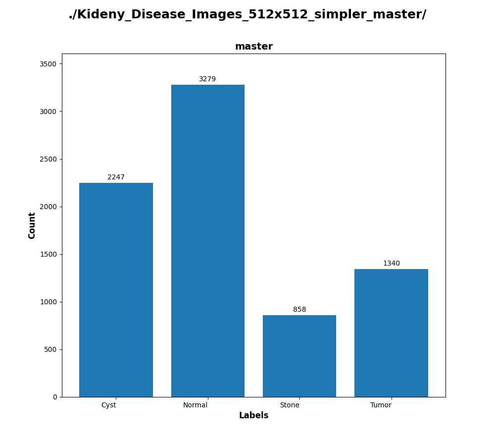

 
 
3. By applying a resampling tool <a href="https://github.com/martian-antillia/ImageDatasetResampler">ImageDatasetResampler</a>
to <b>Kideny_Disease_Images_512x512_simpler_master</b>, we have created a balanced dataset <b>Resampled_Kideny_Disease_Images_512x512_simpler_master</b>.  
 
4. We have finally created <a href="./projects/Kidney-Disease/Resampled_Kidney_Disease_Simpler_Images/"><b>Resampled_Kidney_Disease_Simpler_Images</b></a> dataset by applying a script <a href="./projects/Kidney-Disease/split_master.py">
split_master.py</a> to the <b>Resampled_Kideny_Disease_Images_512x512_simpler_master</b>.
<pre>
<pre>
Resampled_Kidney_Disease_Simpler_Images
├─test
│  ├─Cyst
│  ├─Normal
│  ├─Stone
│  └─Tumor
└─train
    ├─Cyst
    ├─Normal
    ├─Stone
    ├─N
    └─Tumor    
</pre>

</pre>
The number of images in the dataset is the following: 
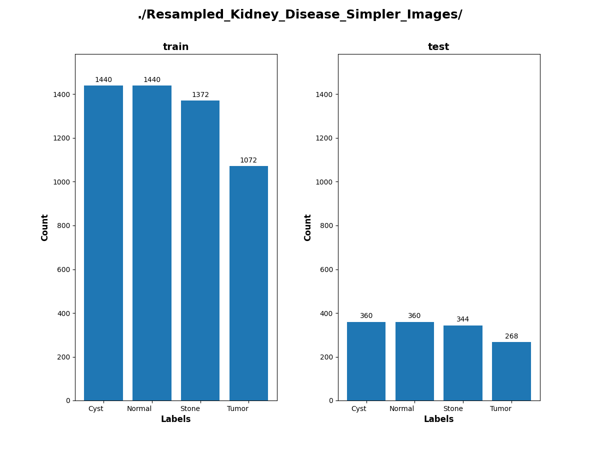 
 

Kidney_Disease_Simpler_Images/train/Cyst: 
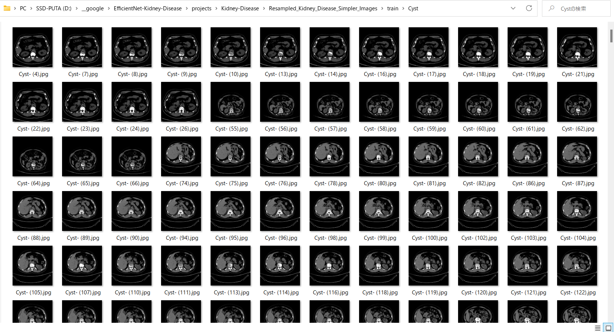
 
 
Kidney_Disease_Simpler_Images/train/Normal: 
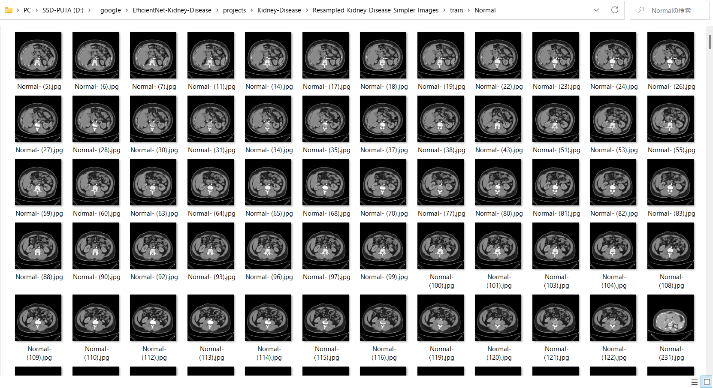
 
 
Kidney_Disease_Simpler_Images/train/Stone: 
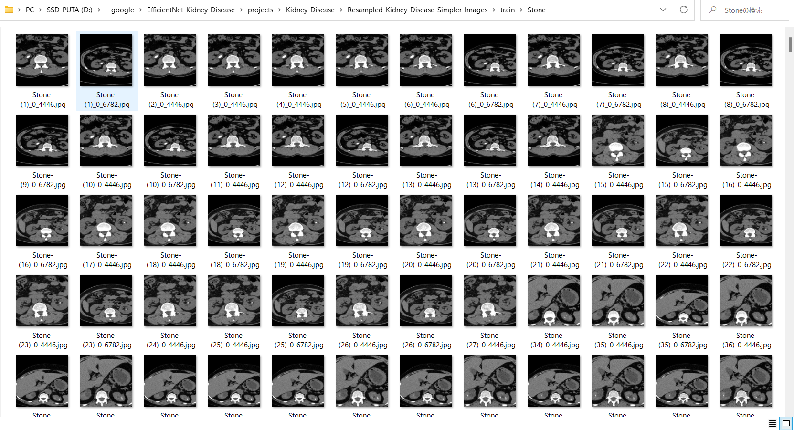
 
 
Kidney_Disease_Simpler_Images/train/Tumor: 
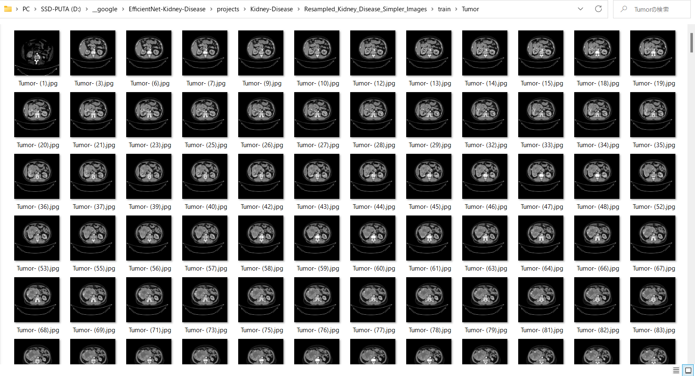
 

<h3>
<a id="#1.3">1.3 Install Python packages</a>
</h3>
Please run the following commnad to install Python packages for this project. 
<pre>
pip install -r requirements.txt
</pre>
 

<h2>
<a id="2">2 Python classes for Kidney Disease Classification</a>
</h2>
We have defined the following python classes to implement our Kidney Disease Classification. 
<li>
<a href="./ClassificationReportWriter.py">ClassificationReportWriter</a>
</li>
<li>
<a href="./ConfusionMatrix.py">ConfusionMatrix</a>
</li>
<li>
<a href="./CustomDataset.py">CustomDataset</a>
</li>
<li>
<a href="./EpochChangeCallback.py">EpochChangeCallback</a>
</li>
<li>
<a href="./EfficientNetV2Evaluator.py">EfficientNetV2Evaluator</a>
</li>
<li>
<a href="./EfficientNetV2Inferencer.py">EfficientNetV2Inferencer</a>
</li>
<li>
<a href="./EfficientNetV2ModelTrainer.py">EfficientNetV2ModelTrainer</a>
</li>
<li>
<a href="./FineTuningModel.py">FineTuningModel</a>
</li>

<li>
<a href="./TestDataset.py">TestDataset</a>
</li>

<h2>
<a id="3">3 Pretrained model</a>
</h2>
 We have used pretrained <b>efficientnetv2-m</b> model to train Kidney Disease Classification FineTuning Model.
Please download the pretrained checkpoint file from <a href="https://storage.googleapis.com/cloud-tpu-checkpoints/efficientnet/v2/efficientnetv2-m.tgz">efficientnetv2-m.tgz</a>, expand it, and place the model under our top repository.

<pre>
.
├─asset
├─efficientnetv2-m
└─projects
    └─Kidney-Disease
  ...
</pre>

<h2>
<a id="4">4 Train</a>

</h2>
<h3>
<a id="4.1">4.1 Train script</a>
</h3>
Please run the following bat file to train our Kidney Disease Classification efficientnetv2 model by using
<a href="./projects/Kidney-Disease/Resampled_Kidney_Disease_Simpler_Images/train">Resampled_Kidney_Simpler_Disease_Images/train</a>.
<pre>
./1_train.bat
</pre>
<pre>
rem 1_train.bat
python ../../EfficientNetV2ModelTrainer.py ^
  --model_dir=./models ^
  --eval_dir=./eval ^
  --model_name=efficientnetv2-m  ^
  --data_generator_config=./data_generator.config ^
  --ckpt_dir=../../efficientnetv2-m/model ^
  --optimizer=rmsprop ^
  --image_size=384 ^
  --eval_image_size=480 ^
  --data_dir=./Resampled_Kidney_Disease_Simpler_Images/train ^
  --data_augmentation=True ^
  --valid_data_augmentation=True ^
  --fine_tuning=True ^
  --monitor=val_loss ^
  --learning_rate=0.0001 ^
  --trainable_layers_ratio=0.4 ^
  --dropout_rate=0.4 ^
  --num_epochs=50 ^
  --batch_size=4 ^
  --patience=10 ^
  --debug=True  
</pre>
, where data_generator.config is the following: 
<pre>
; data_generation.config

[training]
validation_split   = 0.2
featurewise_center = Fale
samplewise_center  = False
featurewise_std_normalization=True
samplewise_std_normalization =False
zca_whitening                =False
rotation_range     = 4
horizontal_flip    = False
vertical_flip      = False
width_shift_range  = 0.1
height_shift_range = 0.1
shear_range        = 0.01
zoom_range         = [0.2, 2.4]
data_format        = "channels_last"

[validation]
validation_split   = 0.2
featurewise_center = False
samplewise_center  = False
featurewise_std_normalization=True
samplewise_std_normalization =False
zca_whitening                =False
rotation_range     = 4
horizontal_flip    = False
vertical_flip      = False
width_shift_range  = 0.1
height_shift_range = 0.1
shear_range        = 0.01
zoom_range         = [0.2, 2.4]
data_format        = "channels_last"
</pre>

<h3>
<a id="4.2">4.2 Training result</a>
</h3>

This will generate a <b>best_model.h5</b> in the models folder specified by --model_dir parameter. 
Furthermore, it will generate a <a href="./projects/Kidney-Disease/eval/train_accuracies.csv">train_accuracies</a>
and <a href="./projects/Kidney-Disease/eval/train_losses.csv">train_losses</a> files
 
Training console output: 
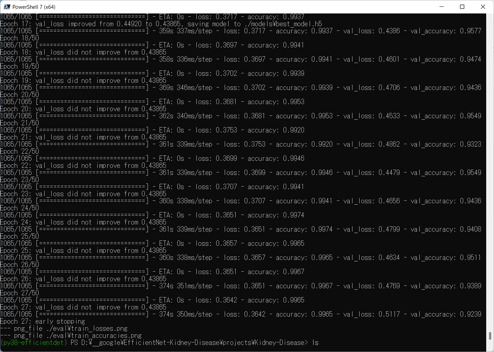 
 
Train_accuracies: 
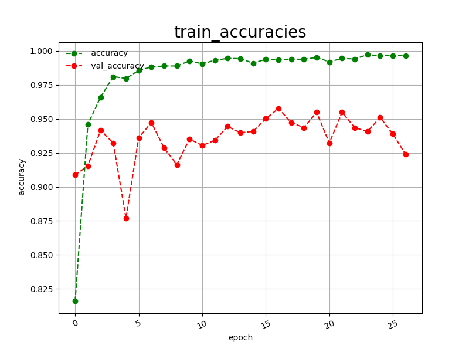 

 
Train_losses: 
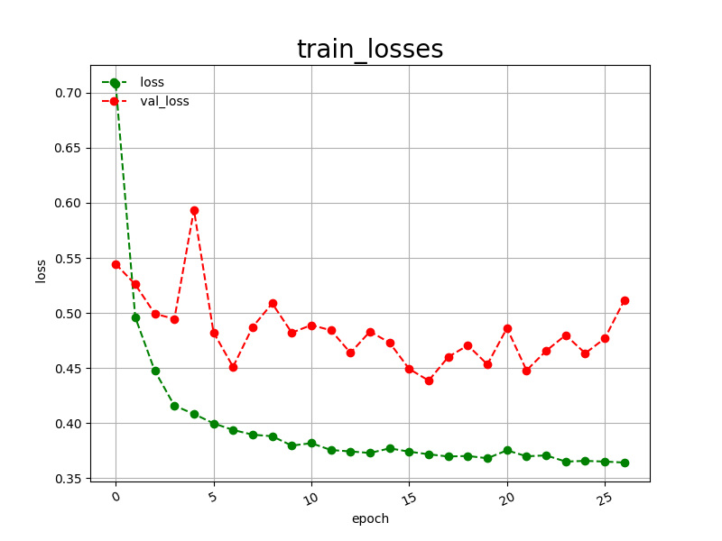 

 
<h2>
<a id="5">5 Inference</a>
</h2>
<h3>
<a id="5.1">5.1 Inference script</a>
</h3>
Please run the following bat file to infer the breast cancer in test images by the model generated by the above train command. 
<pre>
./2_inference.bat
</pre>
<pre>
rem 2_inference.bat
python ../../EfficientNetV2Inferencer.py ^
  --model_name=efficientnetv2-m  ^
  --model_dir=./models ^
  --fine_tuning=True ^
  --trainable_layers_ratio=0.4 ^
  --dropout_rate=0.4 ^
  --image_path=./test/*.jpg ^
  --eval_image_size=480 ^
  --label_map=./label_map.txt ^
  --mixed_precision=True ^
  --infer_dir=./inference ^
  --debug=False 
</pre>
 
label_map.txt:
<pre>
Cyst
Normal
Stone
Tumor
</pre>
 
<h3>
<a id="5.2">5.2 Sample test images</a>
</h3>

Sample test images generated by <a href="./projects/Kidney-Disease/create_test_dataset.py">create_test_dataset.py</a> 
from <a href="./projects/Kidney-Disease/Resampled_Kidney_Disease_Simpler_Images/test">Resampled_Kidney_Disease_Simpler_Imagess/test</a>.
 
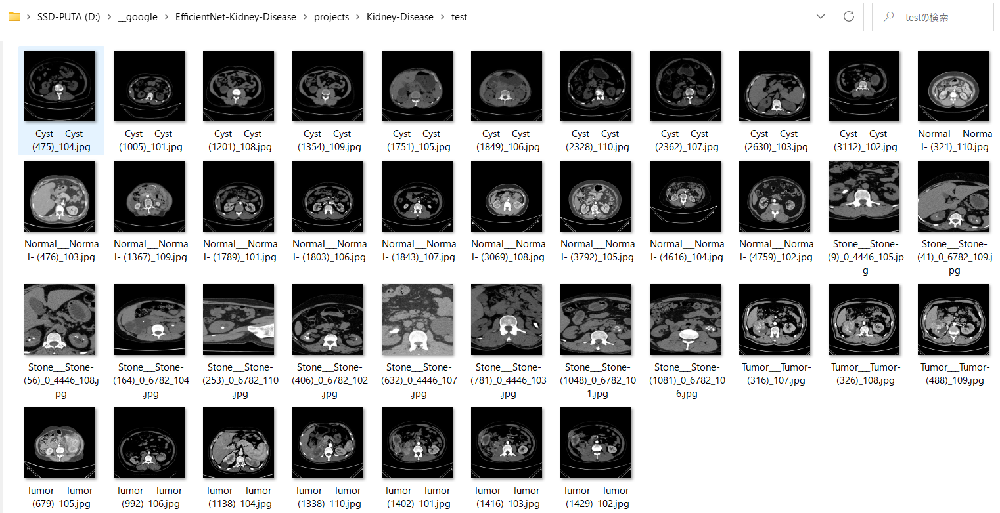 

<h3>
<a id="5.3">5.3 Inference result</a>
</h3>
This inference command will generate <a href="./projects/Kidney-Disease/inference/inference.csv">inference result file</a>.
 
 
Inference console output: 
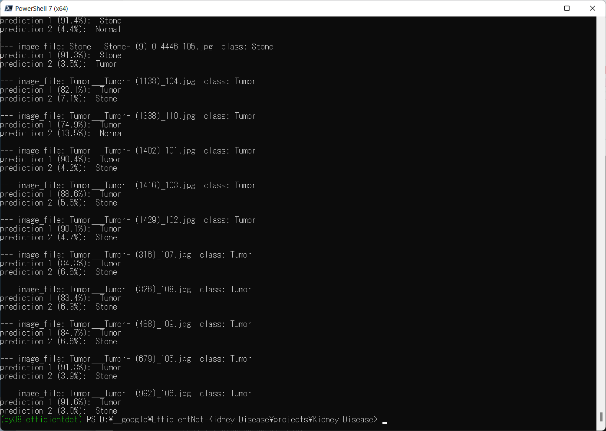 
 

Inference result (inference.csv): 
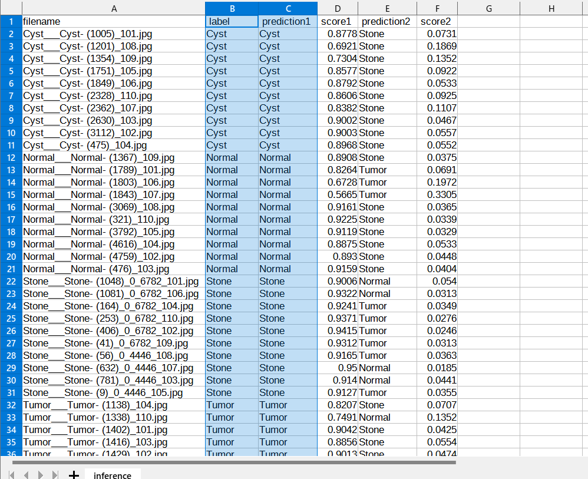 
 
<h2>
<a id="6">6 Evaluation</a>
</h2>
<h3>
<a id="6.1">6.1 Evaluation script</a>
</h3>
Please run the following bat file to evaluate <a href="./projects/Kidney-Disease/Resampled_Kidney_Disease_Simpler_Images/test">
Resampled_Kidney_Simpler_Disease_Images/test</a> by the trained model. 
<pre>
./3_evaluate.bat
</pre>
<pre>
rem 3_evaluate.bat
python ../../EfficientNetV2Evaluator.py ^
  --model_name=efficientnetv2-m  ^
  --model_dir=./models ^
  --data_dir=./Resampled_Kidney_Disease_Simpler_Images/test ^
  --evaluation_dir=./evaluation ^
  --fine_tuning=True ^
  --trainable_layers_ratio=0.4 ^
  --dropout_rate=0.4 ^
  --eval_image_size=480 ^
  --mixed_precision=True ^
  --debug=False 
</pre>
 

<h3>
<a id="6.2">6.2 Evaluation result</a>
</h3>

This evaluation command will generate <a href="./projects/Kidney-Disease/evaluation/classification_report.csv">a classification report</a>
 and <a href="./projects/Kidney-Disease/evaluation/confusion_matrix.png">a confusion_matrix</a>.
 
 
Evaluation console output: 
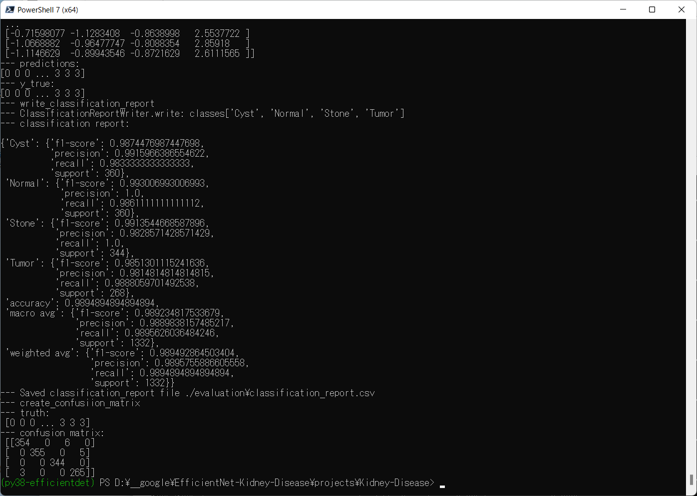 
 

 
Classification report: 
 
 
Confusion matrix: 
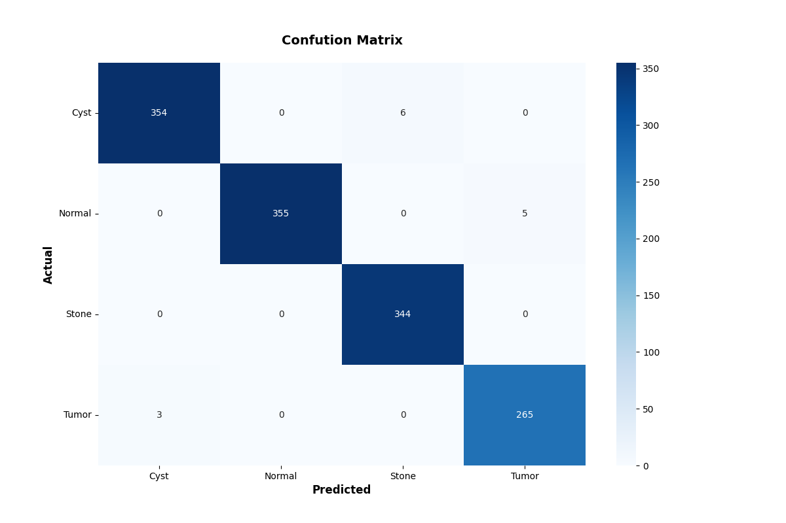 

 
<h3>
References
</h3>
<b>1. CT KIDNEY DATASET: Normal-Cyst-Tumor and Stone</b> 
<pre>
https://www.kaggle.com/datasets/nazmul0087/ct-kidney-dataset-normal-cyst-tumor-and-stone/code
</pre>

<b>2. Urinary Stone Detection on CT Images Using Deep Convolutional Neural Networks: Evaluation of Model Performance and Generalization</b> 

Anushri Parakh, MD,* Hyunkwang Lee, MS,* Jeong Hyun Lee, MD, Brian H. Eisner, MD, Dushyant V. Sahani, MD,corresponding author1 and Synho Do, PhD

<pre>
https://www.ncbi.nlm.nih.gov/pmc/articles/PMC8017404/
</pre>
<b>3. Deep-Learning-Based CT Imaging in the Quantitative Evaluation of Chronic Kidney Diseases</b> 

Xu Fu, Huaiqin Liu, Xiaowang Bi, and Xiao Gong

<pre>
https://www.hindawi.com/journals/jhe/2021/3774423/
</pre>
